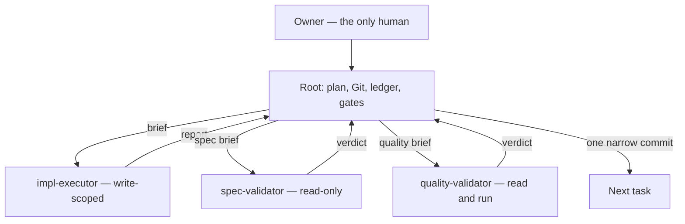

# Root Architect Execution

Root holds the plan, Git, and the ledger. Isolated cheaper agents write product
code and review it. Root does not write product code around a failed
delegation — a hook stops it from trying.

**REQUIRED BACKGROUND:** `superpowers:subagent-driven-development` and
`superpowers:test-driven-development`. Overrides: workers never commit; spec and
quality are separate fresh agents; Git stays at root. Not for one-shot root
edits, `superpowers:executing-plans`, or unmodified SDD.

## Architecture

Three worker roles, each with a capability the others do not have. The roles are
declared once in `roles/*.json` and generated into host agent files; nothing
about a role is hand-written twice.

| Worker | Responsibility | Capability class | Returns |
| --- | --- | --- | --- |
| `impl-executor` | Implement one task under TDD | write-scoped | implementer report |
| `spec-validator` | Judge the diff against the plan | read-only, no shell | validator verdict |
| `quality-validator` | Hunt defects, rerun named commands | read and run | validator verdict |



Root regains control after every worker return. Workers never hand work to each
other, never see each other's briefs, and never address the owner. Root reads a
worker's verdict, never its opinion about what root should do next.

## Authority

Latest owner instruction, then the governing plan, then this skill, then
supporting ADRs and reports. Paused plans and superseded ADRs are evidence, not
build authority. Do not resume a superseded handoff or copy an ancestor
wholesale.

## Takeover

Confirm `pwd`, branch, `HEAD`, and dirty paths; report drift. Read the plan, the
ticket, and the latest session note. Resolve the intended branch, base, and
permitted sync operations from the governing plan and repository policy; never
assume the current `HEAD`, and never hard-code a prohibition on pull, reset, or
rebase. Preserve and report dirty paths. Stop only when the named base has a
conflict that cannot be resolved without touching owner-owned work or history.

Open a session ledger. Run the plan-named baseline commands, checkpoint, make
one bootstrap commit, and file the first owner report from
[references/contracts.md](references/contracts.md).

Then run the capability gate before dispatching anything. Select the host
explicitly; Codex must not run the Claude gate:

```bash
if [ "${RAE_HOST:-claude-code}" = "codex" ]; then
  python3 "$PLUGIN_ROOT/scripts/validate_roles.py" --host codex
  python3 "$PLUGIN_ROOT/scripts/render_agents.py" --host codex --check
else
  python3 "${CLAUDE_PLUGIN_ROOT}/scripts/validate_roles.py"
  python3 "${CLAUDE_PLUGIN_ROOT}/scripts/render_agents.py" --host claude-code --check
fi
```

## Gates

On Codex, set `RAE_HOST=codex` and `PLUGIN_ROOT` to the installed plugin root.
Codex plugin installation copies the bundle but does not provide a
documented post-install callback for custom agents, so activate them explicitly:

```bash
python3 "$PLUGIN_ROOT/scripts/validate_roles.py" --host codex
python3 "$PLUGIN_ROOT/scripts/install_codex.py" --target .codex/agents --plugin-root "$PLUGIN_ROOT"
```

The bootstrap is idempotent and keeps generated agents out of the source tree.
Codex cannot hook-enforce root-versus-worker write separation because its
PreToolUse payload does not document worker identity; that boundary is
instructional and review-based. Claude retains its identity-aware write guard.

Each gate is a hard stop, in order. Nothing advances past a gate that has not
been observed to pass.

1. **Capability gate.** The three named agents resolve on this host, and the
   generated files match `roles/` and `hosts/`. Block rather than fall back: a
   missing role is not a reason for root to do the work itself.
2. **Brief gate.** The brief is schema-conformant and self-contained.
   `dispatch_state.py open` refuses anything else, and refuses a second
   concurrent dispatch.
3. **Return gate.** `check_return.py` validates the worker's return. A malformed
   return earns exactly one corrective retry, which does **not** consume an
   implementation attempt — nothing was implemented differently.
4. **Evidence gate.** A `DONE` report carries observed RED and GREEN counts.
   Tests added after the implementation are recorded as such.
5. **Plan-compliance gate.** A fresh `spec-validator` returns `PASS`.
6. **Quality gate.** A *different* fresh `quality-validator` returns `PASS`.
   Findings from either go back to the same implementer.
7. **Checkpoint gate.** Ledger updated, brief-owned paths staged,
   `git diff --cached --check` clean, one narrow commit.
8. **Outcome gate.** The full recorded baseline, not targeted evidence — and
   whatever else validates the *kind* of artifact the work touched. A test suite
   only checks what it was written to check: a change to a manifest, a schema, a
   lockfile, or generated output can leave every test green and still ship
   broken. Name that validator in the acceptance commands rather than
   discovering the gap afterwards.

## State

One open dispatch is the run's only active signal. It lives at
`<workspace>/.root-architect/state/dispatch-<run_id>.json`; there is no separate
marker file, and both guard hooks re-read it on every call.

```bash
python3 "${CLAUDE_PLUGIN_ROOT}/scripts/dispatch_state.py" open  --brief /tmp/brief.json --run-id 20260907-task-3
python3 "${CLAUDE_PLUGIN_ROOT}/scripts/dispatch_state.py" active
python3 "${CLAUDE_PLUGIN_ROOT}/scripts/dispatch_state.py" close --run-id 20260907-task-3 --outcome accepted
python3 "${CLAUDE_PLUGIN_ROOT}/scripts/dispatch_state.py" verify
```

`verify` reports every record in the state directory, including archived ones,
and exits non-zero if any is corrupt. It is the command the guards' deny
messages name, because a record they refuse to trust is one they will not act
on until it is repaired or removed.

Hand-offs carry resolved inputs, decisions, artifact paths, and hashes — not
accumulated transcripts.

## Per-task loop

One dependent code task at a time; parallelize only independent read-only
discovery. Fill the contracts in
[references/contracts.md](references/contracts.md).

1. **Write the brief.** Name an explicit cheaper model — never `inherit`, which
   every host defaults to and which silently makes a cheap worker as expensive
   as root. Start at the cheapest tier the task could plausibly pass. Escalate
   one tier only after a recorded failure, and put that evidence in
   `escalation_reason`; the brief gate requires it from attempt 2.
2. **Open the dispatch**, then dispatch the implementer. From here the root
   write guard refuses root's own edits to the brief's `write_paths`.
3. **Validate the return** with `check_return.py` before reading it as a result.
4. **Dispatch `spec-validator`**, then — only on `PASS` — a different fresh
   `quality-validator`.
5. **Same worker until three failures**, then `blocked`. Record the reason
   before each escalation; never reset the count by renaming the task.
6. **Close the dispatch, checkpoint, commit** the brief-owned paths plus the
   ledger.

Write a short progress note to the ledger at every dispatch, every returned
verdict, every reproduction, and every ruling — not only at step 6. A rate limit
can end the turn at any moment, and an unrecorded finding is paid for twice.

## Validation scope

Run what the change can reach: the touched module's tests, plus any suite a
named dependency makes plausible. State that reachability argument in the
brief's `constraints`. If you cannot argue what is unaffected, run the full set —
targeted scope is a claim you defend, not a default.

Reuse root's evidence from an unchanged `HEAD` rather than re-running it, and
set `reused: true` so the saving is auditable.

The full baseline sweep belongs to the outcome gate. No outcome is declared
complete on targeted evidence alone.

## Model and effort routing

Tiers are vendor-neutral in `roles/*.json` and mapped per host in `hosts/*.json`.
Pick the starting tier by task shape, not by habit:

| Work | Start at |
| --- | --- |
| Mechanical, tightly specified edit | cheap / low |
| Bounded behaviour change with tests | cheap / medium |
| Coupled state, scheduler, replay, or authority changes | mid / medium |
| Final acceptance before an outcome closes | strong / high, at root's discretion |
| Exact Git mechanics | cheap / low, with an exact allowlist |

Once a task class has demonstrated it needs a stronger starting tier, do not
spend repeated cheap attempts on it. Record the model and effort actually
applied. Where a host cannot set effort, its generated agent file says so and
the checkpoint records `not settable on this host` — naming a level nothing
applied is a false claim about the run.

## Stop conditions

- Block rather than fall back when a named role or its isolation is
  unavailable. The same rule governs the dispatch state itself: a record that
  cannot be read, parsed, or validated blocks root's writes rather than reading
  as "no delegation open". Run `dispatch_state.py verify` to see which file is
  at fault, then repair or remove it — the guards match write tools only, so
  `Bash` stays available to recover with.
- Stop on a malformed worker return after one corrective retry.
- Never allow worker-to-worker handoff, a broadened tool grant, or unbounded
  retries.
- No broad migration, deletion, benchmarking, or release until the prior
  vertical-slice gate is executable and checkpointed.
- If 7-day quota is below 10% or 5-hour below 5%: safe-checkpoint, update the
  handoff and ledger, inform the owner, stand by. If no percentages are exposed,
  record that and react to a host warning or an owner report instead of
  inferring a window from an unlabelled number.

Ask the owner only for: an architectural conflict the plan does not resolve,
overlap with an owner-owned dirty path, credential or destructive work outside
the brief, three failed attempts, a failing prior-outcome gate, or quota. Do not
push, release, tag, merge to `main`, force Git, or delete historical notes
without explicit approval.

## Red flags

Root writing product code; a worker commit; `inherit`; combined spec and quality
in one agent; advancing past a failed gate; editing owner-owned dirty paths;
closing an outcome gate on targeted evidence; reusing evidence without labelling
it; hand-editing a generated agent file; claiming host-enforced isolation the
host does not provide; asking the owner to restate decided architecture.

Excuse counters live in [references/contracts.md](references/contracts.md).
Role definitions, the schemas, and the host capability matrix live in
[references/agents/README.md](references/agents/README.md).
