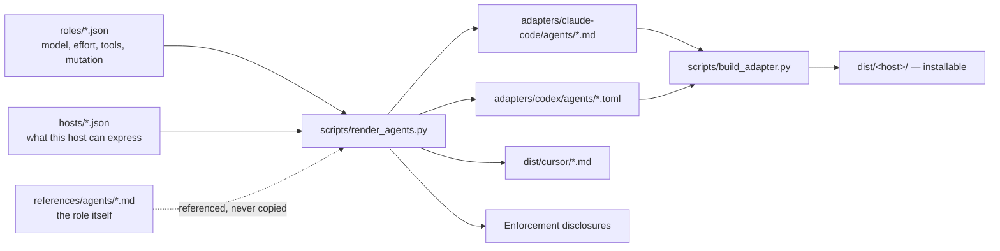

# Agent role definitions

Three roles, declared once and generated per host.

Nothing under `adapters/*/agents/` or `dist/` is hand-written. Edit the role manifest and
regenerate; `scripts/validate_roles.py` fails the capability gate on any drift,
because a hand-edited agent file silently disagrees with the manifest that every
checkpoint quotes.

## Roles

| Role | Mutation class | Model / effort default | File |
| --- | --- | --- | --- |
| Implementer | write-scoped | cheap / low | [impl-executor.md](impl-executor.md) |
| Plan-compliance validator | read-only, no shell | cheap / medium | [spec-validator.md](spec-validator.md) |
| Quality validator | read and run | cheap / medium | [quality-validator.md](quality-validator.md) |

Spec runs first. Quality runs only after spec passes, on a **different** fresh
agent. Combining them is a red flag, and `check_return.py` rejects a verdict
whose role does not match the role root dispatched.

## What the schemas buy

`roles/*.json` is validated against
[../../schemas/agent-role.schema.json](../../schemas/agent-role.schema.json),
which makes four things declarations rather than prose:

- **Model options** — a vendor-neutral tier (`cheap`/`mid`/`strong`) plus an
  ordered escalation path, mapped to real model ids per host. `inherit` is
  unrepresentable, so the failure where an unset model silently makes a cheap
  worker as expensive as root cannot be expressed.
- **Reasoning strength** — an effort level plus its escalation path. Where a
  host's scale is coarser, the renderer says which levels fold together instead
  of implying a level nothing applied.
- **Allowed tools** — portable intents, mapped to host tool names. An intent
  with no mapping on a host is reported, never dropped.
- **Read-only status** — a `mutation` class, distinct from the tool list.
  `read-only` and `read-and-run` differ by exactly one capability, and that
  difference is the reason two review agents exist rather than one.

`validate_roles.py` then checks the contradictions a schema cannot express: a
read-only role granting a shell, an escalation path that goes backwards, a role
granting `delegate`, a `prose` or `returns` path that does not exist, and a
generated file that no longer matches its manifest.

## Host capability matrix

Generated from `hosts/*.json`. Each row states how the host spells a capability
and, where it cannot, what the disclosure says instead.

| | Claude Code | Cursor | Codex |
| --- | --- | --- | --- |
| Verified | **2026-09-07** | 2026-09-04, inherited | 2026-09-04, inherited |
| Location | `.claude/agents/*.md` | `.cursor/agents/*.md` | `.codex/agents/*.toml` |
| Format | Markdown + YAML | Markdown + YAML | TOML |
| Explicit model | `model:` | `model:` | `model =` |
| Model default | **inherits** | **inherits** | **inherits** |
| Reasoning effort | `effort:` (low…max) | inside the model string, `id[effort=high]` | `model_reasoning_effort` |
| Tool allowlist | `tools:` | not expressible | not expressible |
| Tool denylist | `disallowedTools:` | not expressible | not expressible |
| Read-only enforced | yes, by omitting write tools | `readonly: true` | `sandbox_mode = "read-only"` |
| Per-agent hooks | `hooks:` | not expressible | not expressible |

Two consequences the loop must respect.

**Every host defaults to inheriting the parent model.** That is why `inherit` is
forbidden: without an explicit `model`, a cheap worker silently costs what root
costs. Every generated file sets it.

**Reasoning effort *is* settable on Claude Code.** The previous revision of this
matrix asserted the opposite and told root to record `not settable on this host`
on a host that had supported `effort:` for releases — so every checkpoint written
under it understated what the run actually applied. That is the failure the
`verified_on` and `verified` fields exist to prevent: a capability claim now
carries the date and the evidence behind it, and the capability gate prints a
warning for any host manifest still marked inherited.

The Cursor and Codex rows above are carried from the reference project's matrix
and have **not** been re-verified. Re-check them against those hosts' own
documentation before relying on a disclosure produced from them.

## Adding a host

1. Write `hosts/<name>.json` against
   [../../schemas/host-capability.schema.json](../../schemas/host-capability.schema.json).
   Every capability needs a `verified` note — including, especially, every
   `supported: false`, so a capability is never absent merely because nobody
   checked.
2. `python3 scripts/render_agents.py --host <name>`
3. `python3 scripts/validate_roles.py --host <name>`
4. If the host reports agent identity to hooks under a different key than
   `agent_type`, teach `hooks/worker_git_guard.py` about it — otherwise the
   worker prohibitions there are prose on that host, and the disclosure must
   say so.
